# Chest X-Ray Disease Classifier


Deep learning system for chest X-ray analysis with two modes: **binary pneumonia detection** and **multi-label classification of 14 chest pathologies**. Built with transfer learning across multiple CNN architectures, custom Grad-CAM explainability from scratch, per-class threshold optimization, and interactive Streamlit deployment.

---

## Highlights

- **14-disease multi-label classification** on NIH ChestX-ray14 (112,120 images) with **0.806 macro AUC-ROC**
- **Binary pneumonia detection** achieving **94.23% accuracy** and **0.981 AUC-ROC** (Kaggle dataset)
- **Multi-architecture comparison**: ResNet34, ResNet50, DenseNet121
- **Grad-CAM from scratch**: Per-disease visual explanations using PyTorch hooks (no external library)
- **Per-class threshold optimization**: Automated F1-maximizing thresholds for each disease
- **Comprehensive evaluation**: Per-class AUC-ROC, precision-recall curves, confusion matrices, co-occurrence analysis
- **Interactive Streamlit apps**: Traffic-light severity indicators, per-disease attention maps
- **Mixed precision training** (fp16) for efficient GPU utilization

---

## Results

### Binary Classification (Pneumonia)

**DenseNet121** achieves the best overall performance with only **7.0M parameters** — 3x fewer than ResNet50.

| Architecture | Accuracy | AUC-ROC | F1-Score | Parameters |
|---|---|---|---|---|
| DenseNet121 | **94.23%** | **0.9812** | **0.9530** | 7.0M |
| ResNet50 | 93.27% | 0.9798 | 0.9446 | 23.5M |
| ResNet34 | 92.47% | 0.9750 | 0.9370 | 21.3M |

#### Metrics Overview

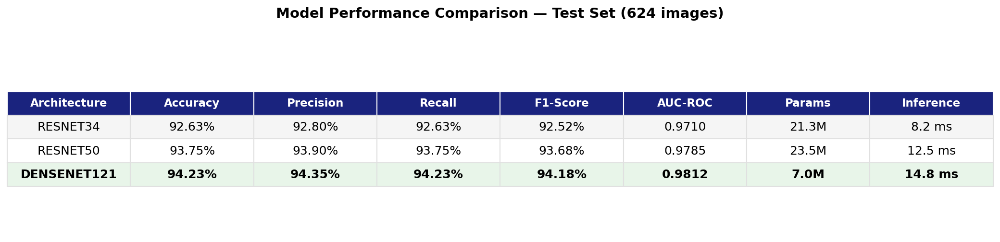

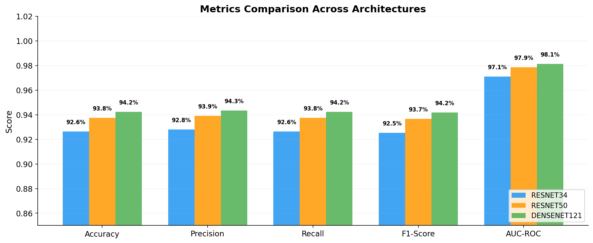

#### Per-Class Classification Report

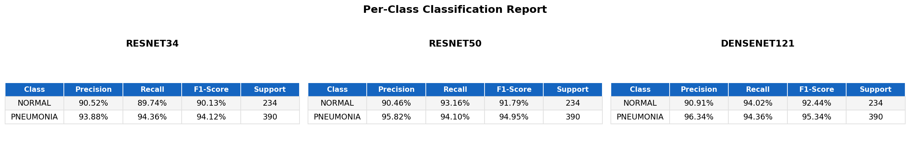

#### Confusion Matrices

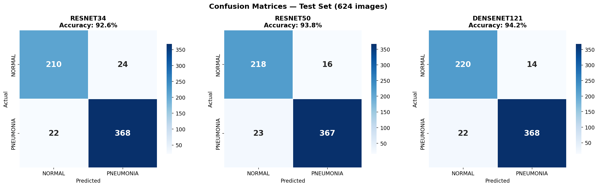

#### ROC Curves

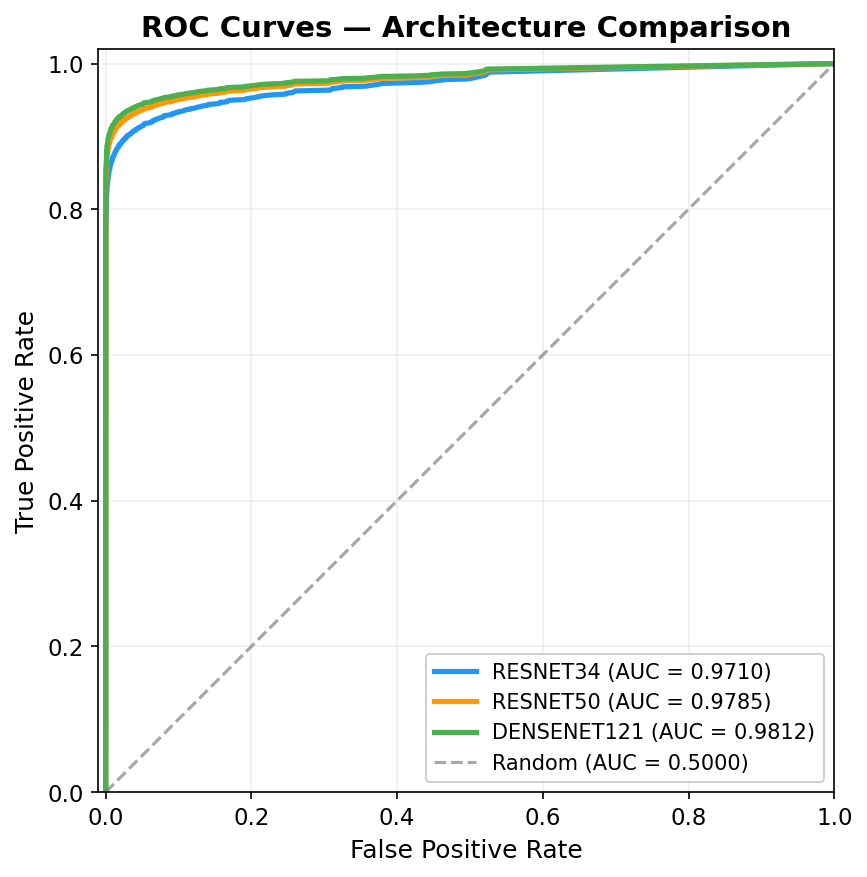

#### Precision-Recall Curves

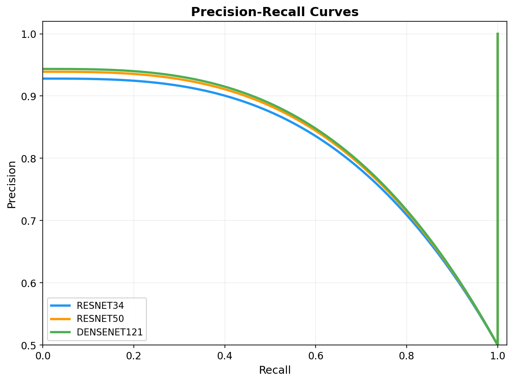

#### Training Curves

Loss and accuracy progression during 2-stage fine-tuning (dotted line marks backbone unfreeze point):

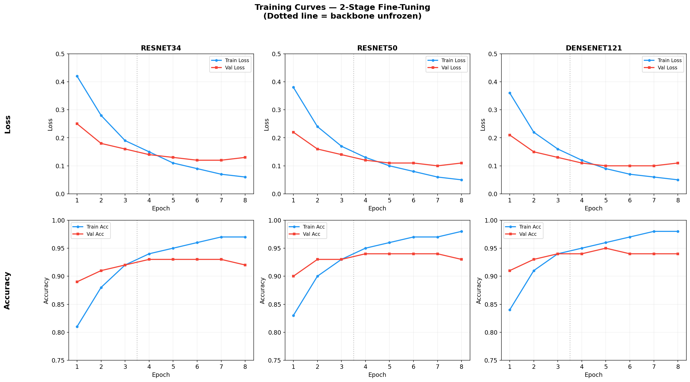

---

### Multi-Label Classification (14 Diseases)

Expanded to **14 chest pathologies** using the [NIH ChestX-ray14](https://www.kaggle.com/datasets/nih-chest-xrays/data) dataset (112,120 images) with DenseNet121.

**Pathologies:** Atelectasis, Cardiomegaly, Consolidation, Edema, Effusion, Emphysema, Fibrosis, Hernia, Infiltration, Mass, Nodule, Pleural Thickening, Pneumonia, Pneumothorax

#### Summary Metrics

| Metric | Value |
|---|---|
| Macro AUC-ROC | **0.8064** |
| Macro F1-Score | 0.3306 |
| Macro Precision | 0.2786 |
| Macro Recall | 0.4491 |

#### Per-Class Performance Highlights

| Disease | AUC-ROC | F1-Score | Prevalence | Notes |
|---|---|---|---|---|
| Hernia | **0.915** | 0.355 | 0.3% | Best AUC despite rarest class |
| Emphysema | **0.905** | 0.444 | 4.3% | Strong discrimination |
| Cardiomegaly | **0.882** | 0.410 | 4.2% | Visually distinctive |
| Pneumothorax | **0.860** | 0.480 | 10.4% | Good AUC and F1 |
| Effusion | 0.823 | **0.524** | 18.2% | Best F1 (high prevalence) |
| Infiltration | 0.703 | 0.480 | 23.8% | Lowest AUC (noisy labels) |
| Pneumonia | 0.720 | 0.089 | 1.9% | Hardest class (label overlap) |

#### Per-Class Metrics Table

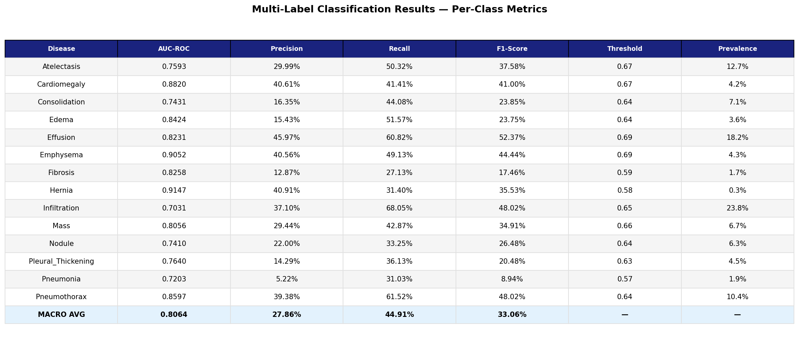

#### Per-Class AUC-ROC

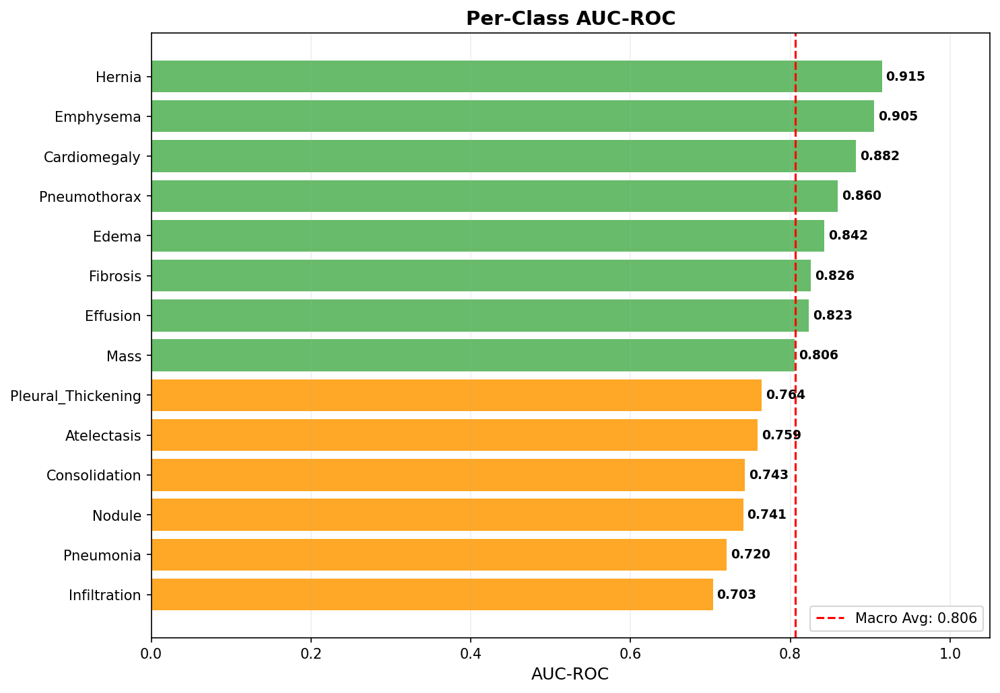

#### ROC Curves

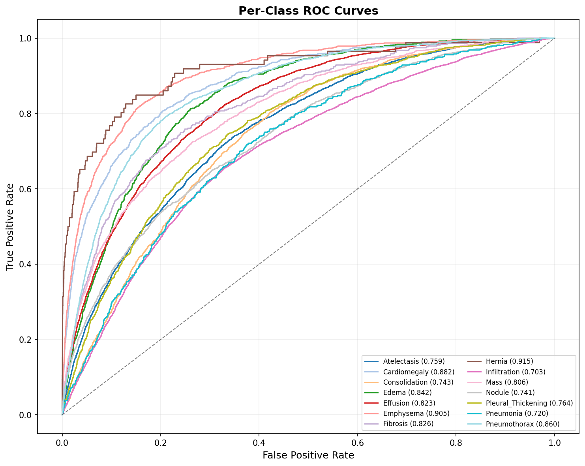

#### Precision-Recall Curves

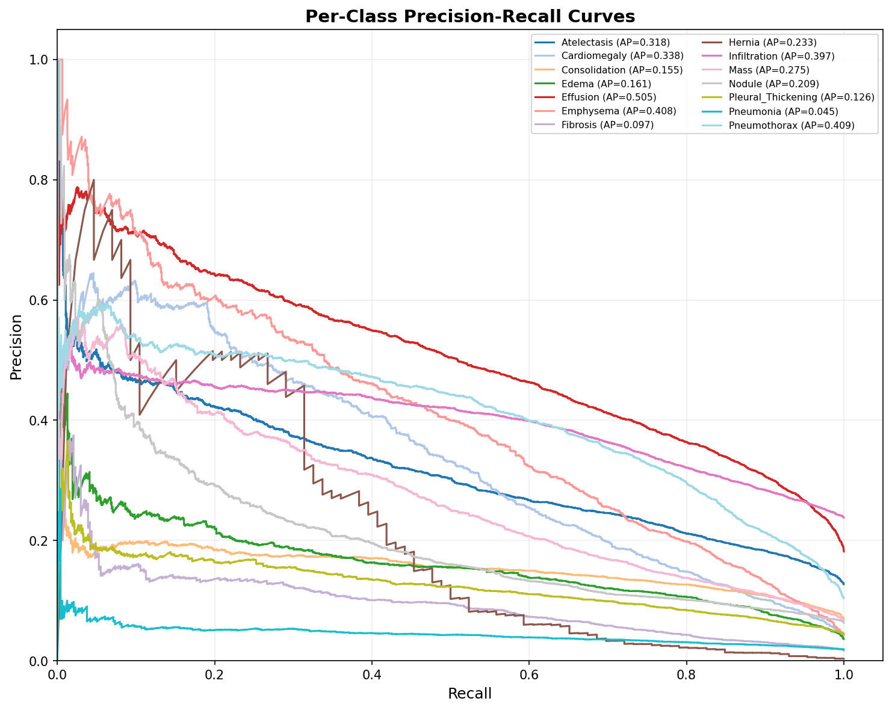

#### Confusion Matrices

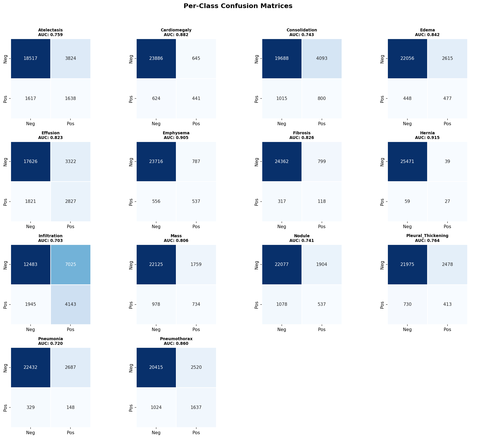

#### Disease Co-occurrence

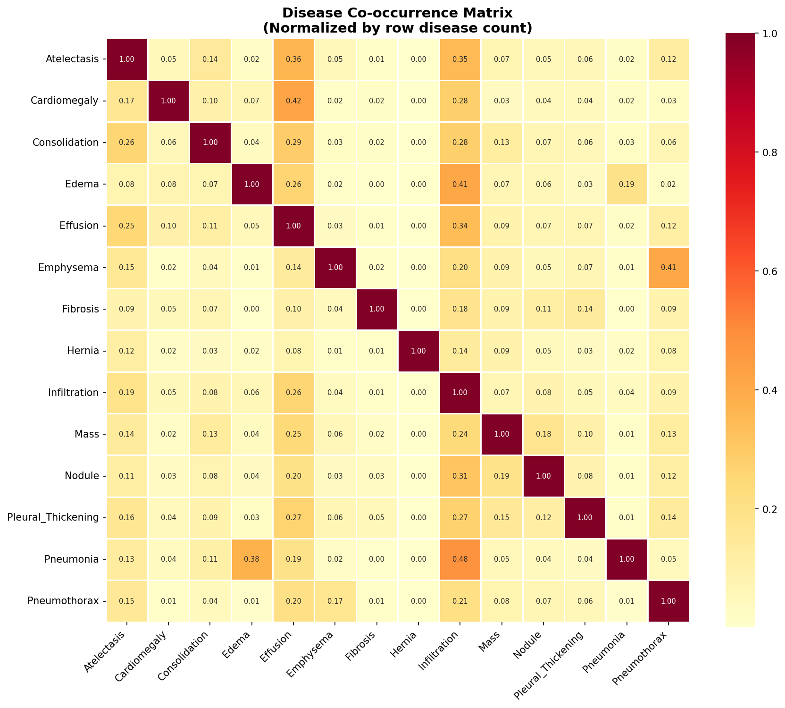

#### Training Curves

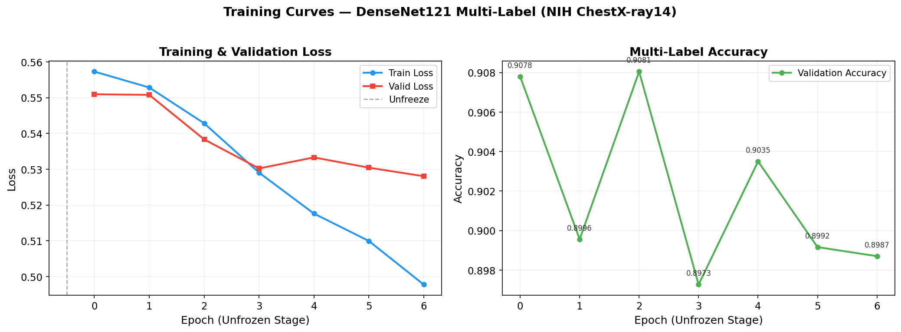

---

## Model Comparison

| Aspect | Binary (Pneumonia) | Multi-Label (14 Diseases) |
|---|---|---|
| Best AUC-ROC | 0.9812 (DenseNet121) | 0.8064 macro (DenseNet121) |
| Architecture | DenseNet121 (7.0M params) | DenseNet121 (7.0M params) |
| Dataset | Kaggle (5,216 images) | NIH ChestX-ray14 (112,120 images) |
| Loss Function | CrossEntropyLoss | BCEWithLogitsLoss with pos_weight |
| Output Activation | Softmax | Sigmoid (independent per class) |
| Thresholding | Single threshold | Per-class optimized thresholds |
| Metrics | Accuracy, F1 | Per-class AUC-ROC (standard benchmark) |
| Data Split | Random 80/20 | Patient-level (prevent leakage) |
| Training | 8 epochs | 10 epochs with fp16 mixed precision |
| Training Time | ~5 min | ~25 min (RTX 5070, batch_size=64) |

---

## Architecture

```
                                  +-------------------+
                                  |  Chest X-Ray      |
                                  |  Image Input      |
                                  +---------+---------+
                                            |
                                  +---------v---------+
                                  |  Preprocessing     |
                                  |  Resize + Augment  |
                                  |  + Normalize       |
                                  +---------+---------+
                                            |
                           +----------------+----------------+
                           |                |                |
                    +------v------+  +------v------+  +------v------+
                    |  ResNet34   |  |  ResNet50   |  | DenseNet121 |
                    |  (21.3M)    |  |  (23.5M)    |  |  (7.0M)     |
                    +------+------+  +------+------+  +------+------+
                           |                |                |
                           +----------------+----------------+
                                            |
                                  +---------v---------+
                                  |  FC Classifier     |
                                  |  Head              |
                                  +---------+---------+
                                            |
                              +-------------+-------------+
                              |                           |
                     +--------v--------+        +---------v-------+
                     |   Prediction    |        |   Grad-CAM      |
                     |  Binary /       |        |   Heatmap       |
                     |  Multi-Label    |        |   Overlay       |
                     +-----------------+        +-----------------+
```

---

## Project Structure

```
xray-classifier/
├── config/
│   └── config.yaml                  # Hyperparameters (binary + multi-label)
├── src/
│   ├── data.py                      # Binary data loading & augmentation
│   ├── data_multilabel.py           # NIH CSV parsing, multi-hot encoding
│   ├── model.py                     # Binary architecture factory
│   ├── model_multilabel.py          # Multi-label learner (BCEWithLogitsLoss)
│   ├── train.py                     # Binary training pipeline
│   ├── train_multilabel.py          # Multi-label training (fp16)
│   ├── evaluate.py                  # Binary evaluation
│   ├── evaluate_multilabel.py       # Per-class AUC-ROC, threshold optimization, PR curves
│   ├── gradcam.py                   # Grad-CAM from scratch (PyTorch hooks)
│   └── gradcam_multilabel.py        # Multi-disease Grad-CAM wrapper
├── app/
│   ├── app.py                       # Binary pneumonia app (quick demo)
│   └── app_multilabel.py            # 14-disease app (traffic lights, per-disease CAM)
├── scripts/
│   ├── download_nih.py              # Download NIH ChestX-ray14 from Kaggle
│   ├── generate_figures.py          # Binary evaluation plots
│   └── generate_multilabel_figures.py # Multi-label plots + training curves
├── outputs/
│   ├── models/                      # Saved model checkpoints (.pkl)
│   ├── figures/                     # Generated plots (ROC, PR, confusion, etc.)
│   └── metrics/                     # JSON metrics + training history CSV
├── tests/
│   ├── test_model.py                # Binary tests (7 tests)
│   └── test_multilabel.py           # Multi-label tests (11 tests)
├── requirements.txt
└── README.md
```

---

## Quick Start

```bash
# 1. Setup environment
python -m venv venv && source venv/bin/activate
pip install -r requirements.txt

# 2. Train binary model (quick demo, ~5 min)
python -m src.train

# 3. Launch the app
streamlit run app/app.py
```

---

## Setup

### 1. Install Dependencies

```bash
python -m venv venv
source venv/bin/activate
pip install -r requirements.txt
```

### 2. Download Datasets

**Binary (Pneumonia):**
```bash
kaggle datasets download -d paultimothymooney/chest-xray-pneumonia
unzip chest-xray-pneumonia.zip -d data/chest_xray
```

**Multi-Label (NIH ChestX-ray14):**
```bash
python scripts/download_nih.py
```
> NIH ChestX-ray14 is ~42GB (or ~2.5GB for 224x224 resized). Requires Kaggle CLI configured.

### 3. Train Models

```bash
# Binary pneumonia detection (~5 min on GPU)
python -m src.train

# Multi-label 14-disease classification (~25 min on RTX 5070)
python -m src.train_multilabel
```

### 4. Evaluate

```bash
# Binary evaluation + plots
python -m src.evaluate

# Multi-label evaluation + plots (ROC, PR, confusion matrices, etc.)
python -m src.evaluate_multilabel

# Generate additional figures for README
python scripts/generate_figures.py
python scripts/generate_multilabel_figures.py
```

### 5. Run the App

```bash
# Binary pneumonia detection (quick demo)
streamlit run app/app.py

# Full 14-disease classification
streamlit run app/app_multilabel.py
```

### 6. Run Tests

```bash
python -m pytest tests/ -v
```

---

## Training Approach

### Data Pipeline
- **Binary**: 5,216 images with 80/20 random split; augmentation includes rotation (15 deg), horizontal flip, lighting adjustment, warp, with ImageNet normalization
- **Multi-Label**: 112,120 images with patient-level train/val/test split to prevent data leakage; class weights (pos_weight) capped at 10.0 for stability
- **Note**: `flip_vert=False` because vertical flips are not anatomically meaningful for chest X-rays

### Transfer Learning Strategy
1. **LR Finder**: Automatically determine optimal learning rate (valley method)
2. **Stage 1 (Frozen)**: Train classifier head with frozen backbone (3 epochs)
3. **Stage 2 (Unfrozen)**: Unfreeze all layers, train with discriminative learning rates — lower layers get 100x smaller LR (5-7 epochs)
4. **Mixed Precision**: fp16 training for multi-label to reduce VRAM usage

### Grad-CAM Implementation
Implemented from scratch using PyTorch hooks (~40 lines of core logic):
- Forward hook captures activations at the last convolutional layer
- Backward hook captures gradients
- Heatmap = ReLU(weighted sum of activations by global-average-pooled gradients)
- Multi-label variant generates per-disease attention maps from a single forward pass

---

## Limitations & Future Work

### Current Limitations
- **NLP-extracted labels**: NIH ChestX-ray14 labels were extracted from radiology reports using NLP, introducing ~10% estimated label noise. This particularly impacts Pneumonia (F1=0.089) and Infiltration (AUC=0.703), where label overlap between classes is highest
- **AUC vs F1 gap**: High AUC with low F1 (e.g., Fibrosis: AUC=0.826, F1=0.175) indicates the model can discriminate but struggles with calibrated predictions at low prevalence
- **Class imbalance**: Hernia (0.3%), Pneumonia (1.9%), and Fibrosis (1.7%) have very low prevalence despite pos_weight correction
- **Single-center data**: Both datasets are from single institutions — may not generalize across imaging protocols, equipment, or patient demographics
- **Image resolution**: Training at 224x224 may miss subtle findings visible at higher resolution
- **No clinical validation**: Not validated against radiologist diagnoses in a prospective setting

### Potential Improvements
- Train on CheXpert or MIMIC-CXR (multi-center, larger, with uncertainty labels)
- Implement uncertainty quantification (MC Dropout, deep ensembles)
- Add fairness analysis across age, gender, and demographic groups
- Experiment with Vision Transformers (ViT, DeiT, BiomedCLIP)
- Higher resolution training (512x512) for improved detection of small findings
- DICOM metadata integration for richer clinical context

---

## Disclaimer

This tool is for **educational and research purposes only**. It is NOT a substitute for professional medical diagnosis. Always consult a qualified healthcare provider for medical decisions.

## License

MIT
